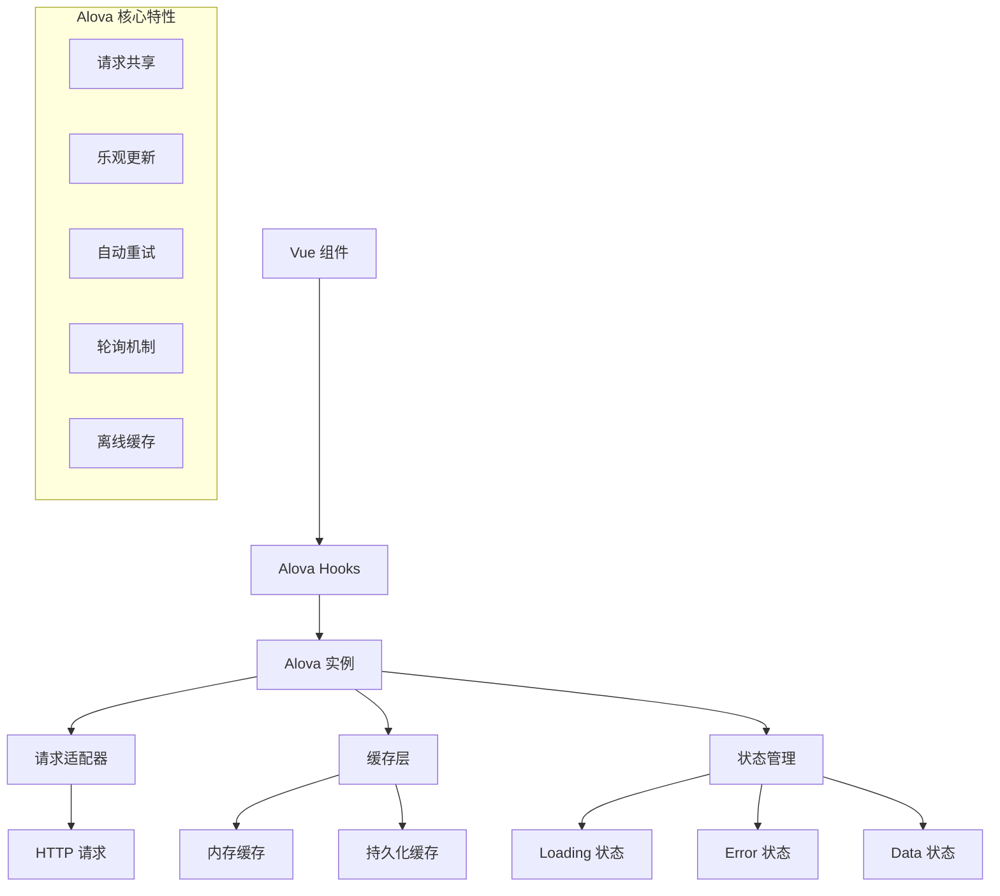

# 设计文档

## 概述

本设计文档详细描述了如何将现有的基于 axios 的网络请求系统迁移到 alova v3，并充分利用 alova v3 的现代化特性来提升应用性能和用户体验。迁移不仅仅是简单的库替换，而是要重新设计请求架构，引入智能缓存、请求共享、乐观更新等高级特性。

## 架构设计

### 整体架构



### 核心组件设计

#### 1. Alova 实例配置
- **基础配置**: 创建统一的 alova 实例，配置基础 URL、超时时间等
- **请求拦截器**: 处理 token 注入、请求日志等
- **响应拦截器**: 处理统一的错误处理、token 过期等
- **缓存策略**: 配置不同类型请求的缓存策略

#### 2. API 方法定义
- **RESTful API**: 使用 alova 的 Method 定义各种 API 方法
- **类型安全**: 提供完整的 TypeScript 类型定义
- **缓存标识**: 为每个 API 方法配置合适的缓存键和策略

#### 3. Vue 集成层
- **Hooks 封装**: 使用 useRequest、useWatcher 等 hooks
- **状态管理**: 自动管理 loading、data、error 状态
- **生命周期**: 与 Vue 组件生命周期集成

## 组件和接口设计

### 1. Alova 实例配置 (src/api/alova.js)

```javascript
import { createAlova } from 'alova'
import VueHook from 'alova/vue'
import GlobalFetch from 'alova/GlobalFetch'
import { createServerTokenAuthentication } from 'alova/client'

// 创建 alova 实例
const alovaInstance = createAlova({
  statesHook: VueHook,
  requestAdapter: GlobalFetch(),
  baseURL: config.BASE_API,
  timeout: 10000,
  
  // 全局请求拦截器
  beforeRequest(method) {
    // Token 处理
    const authStore = useAuthStore()
    const token = authStore.getToken()
    if (token) {
      method.config.headers.Authorization = `Bearer ${token}`
    }
  },
  
  // 全局响应拦截器
  responded: {
    onSuccess: async (response, method) => {
      const data = await response.json()
      if (!data.status && data.code === 401) {
        // Token 过期处理
        const authStore = useAuthStore()
        authStore.clearToken()
        router.push('/login')
        throw new Error('登录已过期')
      }
      return data
    },
    onError: (error, method) => {
      message.error(error.message || '网络请求失败')
      throw error
    }
  }
})
```

### 2. API 方法定义 (src/api/methods/)

#### 用户认证 API
```javascript
// src/api/methods/auth.js
import { alovaInstance } from '../alova'

export const authMethods = {
  // 登录 - 不缓存
  login: (data) => alovaInstance.Post('/auth/login', data, {
    name: 'login',
    cacheFor: 0, // 不缓存
  }),
  
  // 获取用户信息 - 缓存 5 分钟
  getUserInfo: () => alovaInstance.Get('/auth/user', {
    name: 'userInfo',
    cacheFor: 5 * 60 * 1000,
    hitSource: 'memory', // 内存缓存
  }),
  
  // 注册 - 不缓存
  register: (data) => alovaInstance.Post('/auth/register', data, {
    name: 'register',
    cacheFor: 0,
  })
}
```

#### 事件 API
```javascript
// src/api/methods/events.js
import { alovaInstance } from '../alova'

export const eventMethods = {
  // 获取事件列表 - 智能缓存
  getEventList: (params) => alovaInstance.Get('/events', {
    name: 'eventList',
    params,
    cacheFor: {
      mode: 'restore', // 恢复模式，先返回缓存再请求新数据
      expire: 2 * 60 * 1000, // 2分钟过期
    },
    hitSource: ['memory', 'l2'], // 多级缓存
    transform: (data) => ({
      events: data.data.events,
      pagination: data.data.pagination
    })
  }),
  
  // 获取事件详情 - 长期缓存
  getEventDetail: (id) => alovaInstance.Get(`/events/${id}`, {
    name: 'eventDetail',
    cacheFor: 10 * 60 * 1000, // 10分钟缓存
    hitSource: 'memory',
  }),
  
  // 创建事件 - 乐观更新
  createEvent: (data) => alovaInstance.Post('/events', data, {
    name: 'createEvent',
    cacheFor: 0,
    // 乐观更新：立即更新事件列表缓存
    transformData: (response, method) => {
      // 更新事件列表缓存
      updateCache('eventList', (cachedData) => {
        if (cachedData?.events) {
          cachedData.events.unshift(response.data)
          cachedData.pagination.total += 1
        }
        return cachedData
      })
      return response
    }
  }),
  
  // 更新事件
  updateEvent: (id, data) => alovaInstance.Put(`/events/${id}`, data, {
    name: 'updateEvent',
    cacheFor: 0,
    // 自动失效相关缓存
    invalidateCache: ['eventList', `eventDetail-${id}`]
  }),
  
  // 删除事件
  deleteEvent: (id) => alovaInstance.Delete(`/events/${id}`, {
    name: 'deleteEvent',
    cacheFor: 0,
    invalidateCache: ['eventList', `eventDetail-${id}`]
  })
}
```

### 3. 高级特性封装

#### 分页处理
```javascript
// src/composables/usePagination.js
import { ref, computed } from 'vue'
import { useRequest } from 'alova'

export function usePagination(methodHandler, options = {}) {
  const currentPage = ref(1)
  const pageSize = ref(options.pageSize || 10)
  const searchParams = ref(options.searchParams || {})
  
  // 创建分页请求方法
  const createMethod = () => methodHandler({
    currentPage: currentPage.value,
    pageSize: pageSize.value,
    ...searchParams.value
  })
  
  // 使用 alova 的 useRequest
  const {
    loading,
    data,
    error,
    send: refresh,
    onSuccess,
    onError
  } = useRequest(createMethod, {
    immediate: true,
    // 启用分页缓存
    cacheFor: 2 * 60 * 1000,
    // 请求共享
    shareRequest: true
  })
  
  // 分页数据
  const items = computed(() => data.value?.events || [])
  const total = computed(() => data.value?.pagination?.total || 0)
  
  // 分页操作
  const changePage = (page) => {
    currentPage.value = page
    refresh()
  }
  
  const changePageSize = (size) => {
    pageSize.value = size
    currentPage.value = 1
    refresh()
  }
  
  const search = (params) => {
    searchParams.value = { ...searchParams.value, ...params }
    currentPage.value = 1
    refresh()
  }
  
  return {
    loading,
    items,
    total,
    currentPage,
    pageSize,
    error,
    changePage,
    changePageSize,
    search,
    refresh
  }
}
```

#### 实时数据轮询
```javascript
// src/composables/usePolling.js
import { useWatcher } from 'alova'

export function usePolling(methodHandler, options = {}) {
  const {
    data,
    loading,
    error,
    send,
    stop,
    onSuccess
  } = useWatcher(
    methodHandler,
    [/* 监听的响应式数据 */],
    {
      immediate: true,
      // 轮询间隔
      pollingTime: options.interval || 5000,
      // 页面隐藏时停止轮询
      abortLast: true,
      // 网络重连时自动恢复
      enableNetwork: true,
      // 页面重新聚焦时刷新
      enableFocus: true
    }
  )
  
  return {
    data,
    loading,
    error,
    start: send,
    stop,
    onSuccess
  }
}
```

### 4. Vue 组件集成

#### 事件列表组件改造
```javascript
// src/views/Event/Event.vue (部分代码)
import { usePagination } from '@/composables/usePagination'
import { eventMethods } from '@/api/methods/events'

export default {
  setup() {
    // 使用分页 hook
    const {
      loading,
      items: events,
      total,
      currentPage,
      pageSize,
      changePage,
      changePageSize,
      search,
      refresh
    } = usePagination(eventMethods.getEventList, {
      pageSize: 9
    })
    
    // 搜索处理
    const searchQuery = ref({
      title: '',
      type: '',
      feeType: '',
      difficulty: ''
    })
    
    const handleSearch = () => {
      search(searchQuery.value)
    }
    
    return {
      loading,
      events,
      total,
      currentPage,
      pageSize,
      searchQuery,
      handleSearch,
      changePage,
      changePageSize,
      refresh
    }
  }
}
```

#### 登录组件改造
```javascript
// src/views/Login/Login.vue (部分代码)
import { useRequest } from 'alova'
import { authMethods } from '@/api/methods/auth'

export default {
  setup() {
    // 登录请求
    const {
      loading: loginLoading,
      send: login,
      onSuccess: onLoginSuccess,
      onError: onLoginError
    } = useRequest(authMethods.login, {
      immediate: false
    })
    
    // 获取用户信息请求
    const {
      send: getUserInfo
    } = useRequest(authMethods.getUserInfo, {
      immediate: false
    })
    
    const handleLogin = async (values) => {
      try {
        const response = await login({
          login: values.login_username,
          password: values.login_password
        })
        
        if (response.status) {
          // 存储 token
          authStore.setToken(response.data.token)
          
          // 获取用户信息
          const userInfo = await getUserInfo()
          if (userInfo.status) {
            authStore.setUser(userInfo.data)
          }
          
          message.success('登录成功')
          router.push('/')
        }
      } catch (error) {
        message.error(error.message || '登录失败')
      }
    }
    
    return {
      loginLoading,
      handleLogin
    }
  }
}
```

## 数据模型

### 缓存策略模型
```javascript
const cacheStrategies = {
  // 用户数据 - 中等缓存时间
  user: {
    expire: 5 * 60 * 1000, // 5分钟
    hitSource: 'memory'
  },
  
  // 事件列表 - 短缓存 + 恢复模式
  eventList: {
    mode: 'restore',
    expire: 2 * 60 * 1000, // 2分钟
    hitSource: ['memory', 'l2']
  },
  
  // 事件详情 - 长缓存
  eventDetail: {
    expire: 10 * 60 * 1000, // 10分钟
    hitSource: 'memory'
  },
  
  // 静态数据 - 长期缓存
  venues: {
    expire: 30 * 60 * 1000, // 30分钟
    hitSource: ['memory', 'l2']
  }
}
```

### 请求状态模型
```javascript
const requestStates = {
  loading: false,    // 请求进行中
  data: null,        // 响应数据
  error: null,       // 错误信息
  downloading: 0,    // 下载进度
  uploading: 0       // 上传进度
}
```

## 错误处理

### 统一错误处理策略
1. **网络错误**: 自动重试机制，最多重试 3 次
2. **认证错误**: 自动清除 token，跳转登录页
3. **业务错误**: 显示具体错误信息
4. **缓存错误**: 降级到网络请求

### 错误恢复机制
```javascript
const errorRecovery = {
  // 自动重试配置
  retry: {
    count: 3,
    delay: [1000, 2000, 4000], // 递增延迟
    when: (error) => error.code >= 500 // 仅服务器错误重试
  },
  
  // 离线处理
  offline: {
    queue: true,        // 离线时队列请求
    autoResend: true    // 联网后自动发送
  }
}
```

## 测试策略

### 单元测试
- **API 方法测试**: 测试各个 API 方法的正确性
- **缓存逻辑测试**: 测试缓存的存储和失效逻辑
- **错误处理测试**: 测试各种错误场景的处理

### 集成测试
- **组件集成测试**: 测试组件与 alova hooks 的集成
- **状态管理测试**: 测试与 Pinia 的集成
- **路由集成测试**: 测试路由跳转时的请求处理

### 性能测试
- **缓存命中率**: 监控缓存的有效性
- **请求共享效果**: 测试重复请求的合并效果
- **内存使用**: 监控缓存的内存占用

## 迁移策略

### 渐进式迁移
1. **第一阶段**: 替换核心 API 方法（认证、用户信息）
2. **第二阶段**: 迁移列表类 API，引入分页和缓存
3. **第三阶段**: 迁移详情类 API，优化缓存策略
4. **第四阶段**: 引入高级特性（乐观更新、轮询等）

### 兼容性保证
- 保持现有 API 调用方式的兼容性
- 渐进式替换，确保每个阶段都能正常运行
- 提供回滚机制，出现问题时可以快速回退

## 性能优化

### 缓存优化
- **多级缓存**: 内存缓存 + 持久化缓存
- **智能失效**: 基于数据关联的缓存失效
- **预加载**: 预测用户行为，提前加载数据

### 请求优化
- **请求合并**: 自动合并相同的并发请求
- **请求去重**: 避免重复的网络请求
- **批量请求**: 将多个小请求合并为批量请求

### 用户体验优化
- **乐观更新**: 立即更新 UI，后台同步数据
- **骨架屏**: 在数据加载时显示骨架屏
- **错误重试**: 自动重试失败的请求